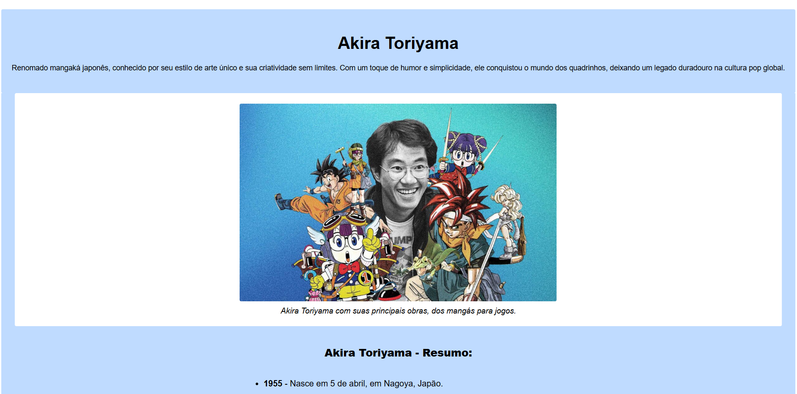

# Certificação de Web Design Responsivo - FreeCodeCamp

Este repositório contém os projetos desenvolvidos como parte da certificação **Web Design Responsivo** da [FreeCodeCamp](https://www.freecodecamp.org/). A certificação abrange conceitos fundamentais de HTML, CSS e design responsivo, com foco na criação de páginas web acessíveis e bem estruturadas.

## Projetos de Certificação

Abaixo estão os projetos desenvolvidos para a certificação, com links para os repositórios e pré-visualizações:

### 1. **Survey Form**
- **Descrição**: Um formulário de pesquisa responsivo com validação de campos.
- **Link do Projeto**: [Survey Form](https://github.com/remyfonseca/freecodecamp-WebDesign/tree/main/surveyForm)
- **Pré-visualização**:
  

---

### 2. **Tribute Page**
- **Descrição**: Uma página de tributo dedicada a uma pessoa ou evento histórico.
- **Link do Projeto**: [Tribute Page](https://github.com/remyfonseca/freecodecamp-WebDesign/tree/main/tributePage)
- **Pré-visualização**:
  

---

### 3. **Technical Documentation**
- **Descrição**: Uma página de documentação técnica com navegação lateral e conteúdo responsivo.
- **Link do Projeto**: [Technical Documentation](https://github.com/remyfonseca/freecodecamp-WebDesign/tree/main/technicalDocumentationPage)
- **Pré-visualização**:
  

---

### 4. **Product Landing Page**
- **Descrição**: Uma landing page de produto com navegação, seções de destaque e preços.
- **Link do Projeto**: [Product Landing Page](https://github.com/remyfonseca/freecodecamp-WebDesign/tree/main/productLandingPage)
- **Pré-visualização**:
  

---

### 5. **FreeCodeCamp - Exercícios**
- **Descrição**: Coleção de exercícios e projetos menores desenvolvidos no CodePen.
- **Link do Projeto**: [CodePen Collection](https://codepen.io/remyfonseca/collections/)
- **Pré-visualização**:
  

---

## Tecnologias Utilizadas

- **HTML5**: Estruturação semântica das páginas.
- **CSS3**: Estilização e design responsivo.
- **Font Awesome**: Ícones para navegação e links sociais.
- **GitHub**: Controle de versão e hospedagem do código.

## Estrutura do Repositório

```plaintext
/
├── assets/                     # Imagens e recursos visuais
├── surveyForm/                 # Código do projeto Survey Form
├── tributePage/                # Código do projeto Tribute Page
├── technicalDocumentationPage/ # Código do projeto Technical Documentation
├── productLandingPage/         # Código do projeto Product Landing Page
├── [index.html](http://_vscodecontentref_/0)                  # Página inicial do portfólio
├── styles.css                  # Estilos globais do portfólio
└── README.md                   # Documentação do repositório